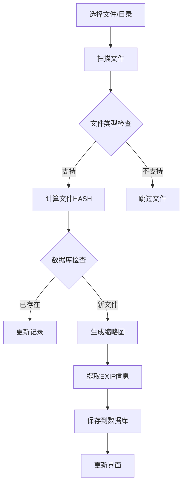
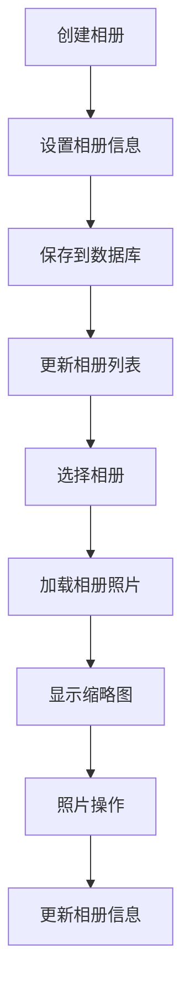
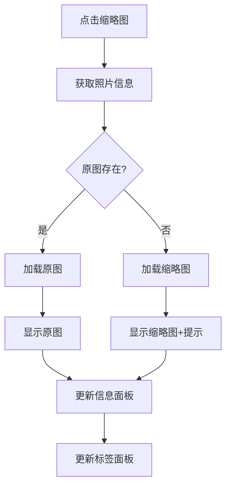

# PyPhotoManager 开发设计文档

## 项目概述

PyPhotoManager 是一个基于 Python 和 PyQt6 的专业照片管理软件，提供照片导入、组织、查看和管理功能。

## 系统架构

### 整体架构
```
┌─────────────────┐    ┌─────────────────┐    ┌─────────────────┐
│   GUI Layer     │    │  Business Layer │    │  Data Layer     │
│                 │    │                 │    │                 │
│ - MainWindow    │◄──►│ - PhotoManager  │◄──►│ - Database      │
│ - AlbumManager  │    │ - ImageProcessor│    │ - FileSystem    │
│ - PhotoViewer   │    │ - TagManager    │    │ - Thumbnails    │
│ - TagManager    │    │ - SearchEngine  │    │                 │
└─────────────────┘    └─────────────────┘    └─────────────────┘
```

### 模块设计

#### 1. GUI 层 (src/picman/gui/)
- **MainWindow**: 主窗口，协调各个组件
- **AlbumManager**: 相册管理界面
- **PhotoViewer**: 照片查看器
- **TagManager**: 标签管理界面
- **ThumbnailWidget**: 缩略图网格组件
- **SettingsDialog**: 设置对话框

#### 2. 业务逻辑层 (src/picman/core/)
- **PhotoManager**: 照片管理核心逻辑
- **ImageProcessor**: 图像处理
- **DirectoryScanner**: 目录扫描
- **ThumbnailGenerator**: 缩略图生成

#### 3. 数据层 (src/picman/database/)
- **DatabaseManager**: 数据库管理
- **PhotoRepository**: 照片数据访问
- **AlbumRepository**: 相册数据访问
- **TagRepository**: 标签数据访问

#### 4. 工具层 (src/picman/utils/)
- **LanguageManager**: 多语言支持
- **LoggingManager**: 日志管理
- **ConfigManager**: 配置管理

## 界面设计

### 主窗口布局 (6区域设计)

```
┌─────────────────────────────────────────────────────────────┐
│                       菜单栏和工具栏                          │
├─────────────┬───────────────────────────────────────────────┤
│             │                                               │
│   1区       │                   4区                         │
│ 相册管理区   │               照片预览区                      │
│             │                                               │
├─────────────┤                                               │
│             │                                               │
│   2区       │                                               │
│ 相册照片区   │                                               │
│ (缩略图)    │                                               │
├─────────────┼───────────────────────────────────────────────┤
│   3区       │                   5区                         │
│ 图片搜索区   │               照片信息区                      │
├─────────────┼───────────────────────────────────────────────┤
│   6区       │                                               │
│ 标签管理区   │                                               │
└─────────────┴───────────────────────────────────────────────┘
```

### 区域功能说明

#### 1区 - 相册管理区
- 相册列表显示
- 新建/删除相册
- 相册选择（支持多选）
- 相册信息显示

#### 2区 - 相册照片区
- 缩略图网格显示
- 照片选择（支持多选）
- 操作按钮（删除、导出等）
- 分页或滚动加载

#### 3区 - 图片搜索区
- 搜索输入框
- 筛选条件（日期、标签、评分等）
- 搜索结果缩略图
- 高级搜索选项

#### 4区 - 照片预览区
- 大图显示
- 缩放控制
- 旋转功能
- 全屏模式

#### 5区 - 照片信息区
- 基本信息（文件名、大小、日期）
- EXIF信息
- 评分和收藏
- 备注编辑

#### 6区 - 标签管理区
- 标签列表
- 标签创建/删除
- 标签分配
- 标签统计

## 数据库设计

### 核心表结构

#### photos 表
```sql
CREATE TABLE photos (
    id INTEGER PRIMARY KEY,
    filename TEXT NOT NULL,
    filepath TEXT NOT NULL,
    file_size INTEGER,
    file_hash TEXT,
    thumbnail_path TEXT,
    date_taken TEXT,
    format TEXT,
    width INTEGER,
    height INTEGER,
    rating INTEGER DEFAULT 0,
    is_favorite BOOLEAN DEFAULT 0,
    notes TEXT,
    exif_data TEXT,
    tags TEXT,
    created_date TEXT,
    modified_date TEXT
);
```

#### albums 表
```sql
CREATE TABLE albums (
    id INTEGER PRIMARY KEY,
    name TEXT NOT NULL,
    description TEXT,
    cover_photo_id INTEGER,
    photo_count INTEGER DEFAULT 0,
    created_date TEXT,
    modified_date TEXT
);
```

#### album_photos 表
```sql
CREATE TABLE album_photos (
    id INTEGER PRIMARY KEY,
    album_id INTEGER,
    photo_id INTEGER,
    added_date TEXT,
    FOREIGN KEY (album_id) REFERENCES albums(id),
    FOREIGN KEY (photo_id) REFERENCES photos(id)
);
```

#### tags 表
```sql
CREATE TABLE tags (
    id INTEGER PRIMARY KEY,
    name TEXT UNIQUE NOT NULL,
    color TEXT,
    description TEXT,
    created_date TEXT
);
```

#### photo_tags 表
```sql
CREATE TABLE photo_tags (
    id INTEGER PRIMARY KEY,
    photo_id INTEGER,
    tag_id INTEGER,
    added_date TEXT,
    FOREIGN KEY (photo_id) REFERENCES photos(id),
    FOREIGN KEY (tag_id) REFERENCES tags(id)
);
```

## 核心功能设计

### 1. 照片导入流程



### 2. 相册管理流程



### 3. 照片查看流程



## 技术实现

### 关键技术栈

#### 前端技术
- **PyQt6**: GUI框架
- **Qt Designer**: 界面设计工具
- **QSS**: 样式表

#### 后端技术
- **Python 3.8+**: 主要开发语言
- **SQLite**: 数据库
- **Pillow**: 图像处理
- **structlog**: 日志管理

#### 开发工具
- **VS Code**: 代码编辑器
- **Git**: 版本控制
- **SQLite Browser**: 数据库管理

### 性能优化策略

#### 1. 图片处理优化
- 异步缩略图生成
- 图片缓存机制
- 渐进式加载

#### 2. 数据库优化
- 索引优化
- 连接池管理
- 查询优化

#### 3. 内存管理
- 图片对象池
- 内存监控
- 垃圾回收

## 版本规划

### v1.0.0 (基础版本) ✅ 已完成
- 基本照片导入
- 简单相册管理
- 基础界面

### v1.1.0 (稳定版本) ✅ 已完成
- 完善相册管理
- 修复缩略图查看
- 改进用户体验
- 数据库优化

### v1.2.0 (功能完善版) ✅ 已完成
- 全面中文化界面
- 完善5区照片信息显示
- 优化搜索功能
- 改进数据库操作

### v1.3.0 (功能增强版) 🚧 开发中
- 照片编辑功能
- 高级搜索功能
- 批量操作优化
- 性能优化

### v2.0.0 (高级功能版) 📋 计划中
- 插件系统
- 云端同步
- 移动端支持
- AI标签识别

### v3.0.0 (企业版) 📋 计划中
- 多用户支持
- 权限管理
- 工作流
- 企业级功能

## 开发规范

### 代码规范
- 遵循 PEP 8 规范
   - 使用类型注解
- 编写单元测试
- 文档字符串

### 提交规范
```
feat: 新功能
fix: 修复bug
docs: 文档更新
style: 代码格式
refactor: 重构
test: 测试
chore: 构建过程或辅助工具的变动
```

### 分支管理
- `main`: 主分支，稳定版本
- `develop`: 开发分支
- `feature/*`: 功能分支
- `hotfix/*`: 热修复分支

## 测试策略

### 单元测试
- 核心业务逻辑测试
- 数据库操作测试
- 工具函数测试

### 集成测试
- GUI组件测试
- 数据流测试
- 用户操作测试

### 性能测试
- 大量数据测试
- 内存使用测试
- 响应时间测试

## 部署方案

### 开发环境
- Python虚拟环境
- 本地SQLite数据库
- 开发配置

### 生产环境
- 打包为可执行文件
- 数据库备份策略
- 日志管理

### 分发方式
- GitHub Releases
- PyPI包
- 独立安装包

## 维护计划

### 日常维护
- Bug修复
- 性能监控
- 用户反馈处理

### 版本更新
- 功能增强
- 安全更新
- 兼容性维护

### 长期规划
- 技术栈升级
- 架构优化
- 新功能开发

---

**文档版本**: v1.2.0  
**最后更新**: 2025-07-19  
**维护者**: 开发团队